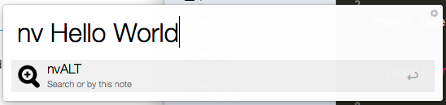
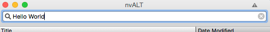
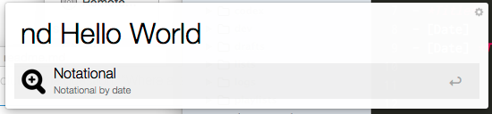
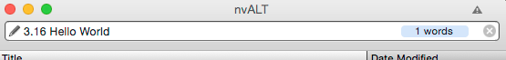

# nvALT Find / Timestamp

This Alfred workflow is a shortcut that focuses on either nvAlt or a search or a new note prefixed with a date.

When I take notes, my notes end up in one of three formats:

- *Title*
- [Date]
- [Date] *Title*


I realized I wanted a workflow that would shortcut this process. If you're using nvALT you'll notice there's no easy keyboard shortcut to sort by date versus by title.

I started adding dates to note titles to keep a consistent sort to content. This was essentially an easy way to chronologically log notes. E.g. "Where are my notes from that meeting on Monday?"

# Alfred Commands

1.  \> ```nv```  
    **Result** Brings up nvAlt

2. \> ```nv Hello World```  
  **Result** Brings up nvAlt with a search "Hello World"  
      
  **Brings up**  
    

-----


1. \> ```nd```  
    **Result** Brings up nvAlt with today's agenda on it. If you're like me, you like to make a lightweight agenda for your day in nvALT. It's fast and easy to read, unlike my outlook calendar!  

4. \> ```nd Hello World```  
  **Result** Brings up nvAlt with a search on today's date and "Hello World"  
      
    **Turns into**  
    

Note: Dates are in format "%m.%d" because I typically don't write dates like this in my notes.

# Credits / Inspiration

- Zoom Icon <http://thenounproject.com/term/zoom/15441/>
- nvALT <http://brettterpstra.com/projects/nvalt/>

I can be found at <http://frankc.net> and on [twitter](https://twitter.com/frankc)
